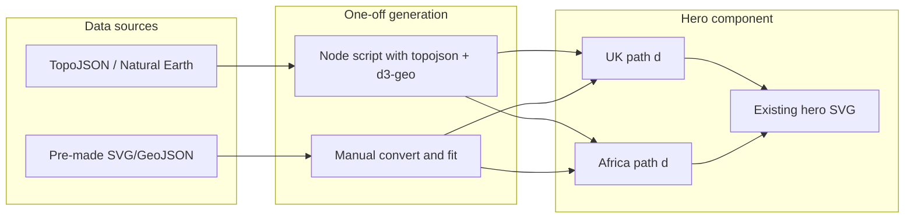

# Hero: Accurate UK and Africa Shapes

## Current state

- **Hero component**: [components/hero-illustration.tsx](c:\Users\Riley\OneDrive\Documents\F2A Website\TestF2A\components\hero-illustration.tsx) — single SVG with `viewBox="0 0 1200 540"`.
- **UK**: Hand-drawn blob path (rough polygon) with a second subpath (Northern Ireland); small footprint (two ellipses).
- **Africa**: Single hand-drawn blob path; small footprint (two ellipses).
- **Rest**: Logo (image), water ripples, dashed flight path, plane animation, foreground wave, gradients and shadow already match the reference tone.

## Goal

- **Smaller island**: Geographically accurate **UK** (optionally Great Britain only to match the reference, or full UK including Northern Ireland).
- **Larger island**: Geographically accurate **Africa** (continent outline).
- Preserve: light green fill, shadow, dashed path UK→Africa, plane, logo, and existing CSS animations.

## Approach: Pre-computed SVG paths (no new runtime deps)

Use **accurate path data** once, then embed the path strings in the hero so the hero stays a single, self-contained SVG with no TopoJSON or geo libs loaded for it.

### 1. Source and generate path data

- **UK**: Use Natural Earth 110m or world-atlas (e.g. [world-atlas countries-110m](https://cdn.jsdelivr.net/npm/world-atlas@2/countries-110m.json)). UK id `826` has two polygons (Great Britain + Northern Ireland). For “accurate UK” you can use both (full UK) or only the main island (GB) to match the reference.
- **Africa**: Use the same TopoJSON and merge African country geometries, or use a single continent outline from Natural Earth (e.g. land/region data).
- **Conversion**: Run a **one-off script** (Node) that:
  - Loads TopoJSON (e.g. `world-atlas/countries-110m` or Natural Earth).
  - Uses `topojson-client` (or equivalent) to get GeoJSON for UK and for Africa (merged countries or continent).
  - Uses `d3-geo` to project (e.g. `geoMercator` or `geoEquirectangular`) and `geoPath().projection()` to produce SVG path `d` strings.
  - Scales and translates the projection so that:
    - UK fits in a box roughly left-of-center (e.g. x ~350–550, y ~120–400 in viewBox 1200×540).
    - Africa fits right-of-center (e.g. x ~720–1050, y ~100–420).
  - Outputs two strings: one for UK, one for Africa.

**Alternative**: If you prefer not to run a script, use a pre-made simplified SVG/GeoJSON (e.g. SimpleMaps UK SVG, or a public Africa outline), convert to a single path `d` (e.g. with [geojson.io](https://geojson.io) + [geojson-to-svg](https://github.com/juliuste/geojson-svgify) or similar), then manually scale/translate to fit the hero viewBox.

### 2. Update the hero component

- In [components/hero-illustration.tsx](c:\Users\Riley\OneDrive\Documents\F2A Website\TestF2A\components\hero-illustration.tsx):
  - Replace the current UK `<path d="...">` (and its second subpath if keeping full UK) with the **new UK path** `d` (single or multiple subpaths).
  - Replace the current Africa `<path d="...">` with the **new Africa path** `d`.
  - Keep: `fill="url(#land-fill)"`, `stroke="#8bb87a"`, `strokeWidth="2"`, `filter="url(#map-shadow)"`, and classes `hero-map hero-map-uk` / `hero-map hero-map-africa`.
  - Keep the footprint groups (two ellipses per landmass); optionally move their `transform` so they sit nicely inside the new shapes.
  - Leave the dashed flight path and plane as-is; only adjust their endpoints/control points if the new shapes require the path to start/end at a different point (e.g. southern UK → northern Africa).

### 3. Optional: Faint footprint icon

- The reference shows a “faint, semi-transparent grey footprint” inside each landmass. The current code uses two ellipses as a simple footprint. You can either keep that or replace with a small footprint SVG path and style it with `fill="#BCC2C6"` and low `opacity` (e.g. 0.3–0.5) to match the reference.

### 4. Files to touch

| File                                                                                                                       | Change                                                                                              |
| -------------------------------------------------------------------------------------------------------------------------- | --------------------------------------------------------------------------------------------------- |
| [components/hero-illustration.tsx](c:\Users\Riley\OneDrive\Documents\F2A Website\TestF2A\components\hero-illustration.tsx) | Replace UK and Africa path `d` attributes; optionally adjust footprint position and flight path.    |
| (New) `scripts/generate-hero-paths.js` or similar                                                                          | Optional one-off script to generate path strings from TopoJSON (if you choose the script approach). |

### 5. Implementation options summary

- **UK shape**: Great Britain only (Scotland, England, Wales) vs full UK (incl. Northern Ireland). The reference suggests GB only; confirm preference.
- **Path source**: (A) One-off Node script with `topojson-client` + `d3-geo` + world-atlas/Natural Earth, or (B) Pre-made SVG/GeoJSON from the web, converted and fitted by hand or a small script.
- **Africa**: Merged African countries from world-atlas, or a single continent polygon from Natural Earth/other source.

No changes to [app/globals.css](c:\Users\Riley\OneDrive\Documents\F2A Website\TestF2A\app\globals.css) are required; existing `.hero-map-uk`, `.hero-map-africa`, and related animations continue to apply.

## Diagram (data flow)

